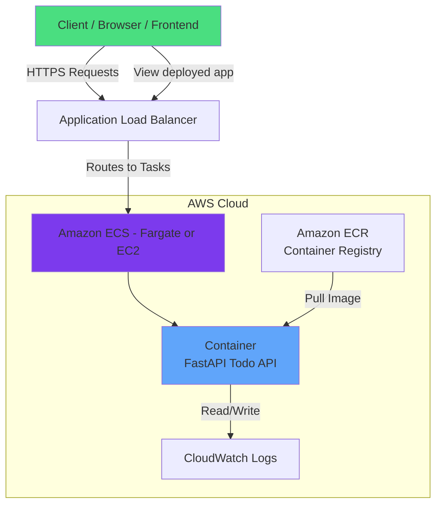

# AWS Containerized Microservice (Todo API)

A production-ready **FastAPI** microservice containerized with Docker, tested with pytest, and designed for deployment on **AWS ECS** (or EC2). This project provides hands-on experience with real cloud deployment architecture, CI/CD, and infrastructure-as-code patterns.

**Theme**: AWS deployment exposure — from local development → Docker → ECR → ECS.

## Architecture



**Key AWS Concepts Demonstrated**:
- Containerization with Docker
- Image storage in **Amazon ECR**
- Orchestration with **Amazon ECS** (Fargate for serverless)
- Load balancing with ALB
- CI/CD pipeline that blocks deployment on test failure
- Health checks and observability

## Features

- RESTful Todo API (CRUD operations)
- FastAPI with automatic Swagger UI (`/docs`)
- 5+ comprehensive tests (unit, integration, load simulation)
- Dockerized for consistent environments
- GitHub Actions CI/CD — **fails build** if tests or Docker build fail
- Full step-by-step AWS deployment guide (ECR + ECS)

## Quick Local Run

```bash
# 1. Clone the repo
git clone https://github.com/Rohan1212Dronacharya/aws-microservice.git
cd aws-microservice

# 2. Run with Docker (recommended)
docker build -t aws-microservice .
docker run -p 8000:8000 aws-microservice

# 3. Open in browser: http://localhost:8000/docs
```

Or run locally without Docker:
```bash
pip install -r requirements.txt
python main.py
```

## Running Tests

```bash
pip install -r requirements.txt
python -m pytest -v
```

All tests pass in CI and locally.

## AWS Deployment (Step-by-Step)

### Prerequisites
- AWS Account with IAM permissions for ECR, ECS, IAM, VPC
- AWS CLI v2 installed and configured (`aws configure`)
- Docker installed

### 1. Build and Push to Amazon ECR

```bash
# Create ECR repository
aws ecr create-repository --repository-name todo-api --region us-east-1

# Login to ECR
aws ecr get-login-password --region us-east-1 | docker login --username AWS --password-stdin YOUR_ACCOUNT_ID.dkr.ecr.us-east-1.amazonaws.com

# Build and tag
docker build -t todo-api .
docker tag todo-api:latest YOUR_ACCOUNT_ID.dkr.ecr.us-east-1.amazonaws.com/todo-api:latest

# Push to ECR
docker push YOUR_ACCOUNT_ID.dkr.ecr.us-east-1.amazonaws.com/todo-api:latest
```

### 2. Deploy to Amazon ECS (Fargate - Serverless)

Recommended: Use the AWS Console or Terraform/CloudFormation.

**High-level steps**:
1. Create an **ECS Cluster**
2. Create a **Task Definition** referencing your ECR image (port 8000, 256 CPU / 512MB memory)
3. Create an **ALB** (Application Load Balancer) with target group
4. Create an **ECS Service** with 2+ tasks behind the ALB
5. Add security groups allowing inbound 80/443 and container port 8000

**Full Terraform example** available in `infrastructure/` (coming soon) or use AWS Console wizard for "Create a service from image".

After deployment, your app will be accessible at the ALB DNS name.

**Architecture flow**: Client → ALB → ECS Tasks (running your container) → CloudWatch Logs.

## CI/CD Pipeline

- Triggered on every `push` and `pull_request` to `main`
- Runs pytest with coverage
- Builds and tests the Docker image
- **Blocks merge** if any step fails (via GitHub branch protection rules — highly recommended to enable on the repo)

See `.github/workflows/ci.yml`

## Presentation Outline (2-3 minutes)

1. **Problem** (20s): How do we reliably deploy applications to the cloud with consistency?
2. **Solution** (40s): Containerization + AWS ECR + ECS.
3. **Live Demo** (60s): Show local Docker run → Swagger UI → tests → CI status on GitHub.
4. **Architecture** (30s): Walk through the Mermaid diagram (Client → ALB → ECS container).
5. **Key Learnings** (30s):
   - Reproducible environments with Docker
   - Image lifecycle (build → ECR → ECS)
   - Decoupled scaling with load balancer
   - Quality gates with CI that blocks bad deployments
6. **Next Steps** (10s): Add Terraform, auto-scaling, monitoring with CloudWatch, CI/CD to ECS via GitHub OIDC.

**Total**: ~3 minutes. Very visual and impressive.

## Project Structure

```
.
├── main.py                 # FastAPI Todo microservice
├── requirements.txt
├── Dockerfile
├── .github/workflows/ci.yml  # CI that blocks bad pushes
├── tests/test_api.py       # 5 comprehensive tests
├── README.md
└── infrastructure/         # (Optional) Terraform templates
```

**Built for hands-on AWS cloud deployment learning.**

---

Ready for submission and class presentation.
